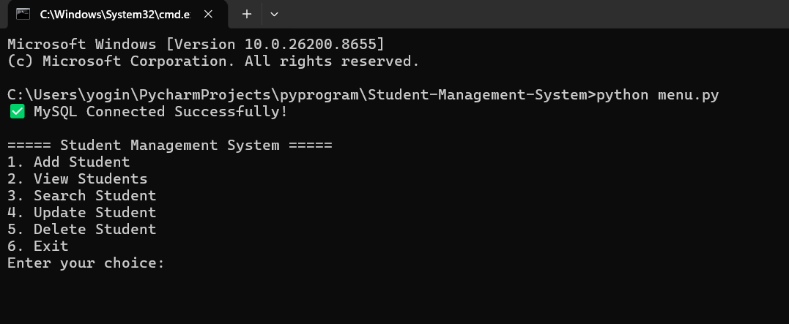

# 🎓 Student Management System

A desktop-based Student Management System developed using Python and MySQL. This project allows users to manage student records efficiently through CRUD operations.

---

## 📌 Project Description

The Student Management System is designed to simplify the management of student information.

It provides an easy-to-use interface where users can:

- Add new students
- View all students
- Search students
- Update student information
- Delete student records

All data is stored securely in a MySQL database.

---

## 🛠 Technologies Used

- Python
- MySQL
- Tkinter (GUI)
- SQL

---

## ✨ Features

✔ Add Student

✔ View Student

✔ Search Student

✔ Update Student

✔ Delete Student

✔ User-Friendly Interface

✔ MySQL Database Connectivity

---

## ⚙ Installation

### 1. Clone the repository

```bash
git clone https://github.com/yogibhokare18/Student-Management-System.git
```

### 2. Open Project

Open the project in VS Code.

### 3. Install Required Packages

```bash
pip install mysql-connector-python
```

### 4. Import Database

Import the SQL file into MySQL.

### 5. Run

```bash
python main.py
```

---

## 📷 Screenshots

### Home Screen



### Add Student


### Search Student


### Update Student


### Delete Student


### View Student


### View Student Details


---

## 👨‍💻 Author

Yoginand Bhokare

BCA Graduate

Aspiring Python Developer

GitHub:
https://github.com/yogibhokare18

---

## ⭐ If you like this project

Give this repository a Star ⭐
